Formation OCR/_GROBID-dictionaries_ 2020

# OCR

Simon Gabay
Strasbourg, Mardi 28 janvier 2020


---
# Une image numérique
---
Deux types d’images:
* Image vectorielle
* Image matricielle (ou bitmap)
---

## Image vectorielle (I)
* Représenter les données de l’image par des formules géométriques qui vont pouvoir être décrites d’un point de vue mathématique (abscisse et ordonnées)
* C’est notamment le format svg (pour _Scalable Vector Graphics_)
* En pratique : pas de problème si on zoom.
---

## Image vectorielle (II)
```{xml}
<svg>
 <rect width="100" height="80" x="0" y="70" fill="green"/>
 <line x1="5" y1="5" x2="250" y2="95" stroke="red" />
 <circle cx="90" cy="80" r="50" fill="blue" />
 <text x="180" y="60">Un texte</text>
</svg>
```


---
## Image vectorielle (III)

Ouvrez le fichier ```image.svg``` dans un navigateur et dans un éditeur de code: comparez!

Pour plus d'exemples, allez regarder du côté de [w3schools](https://www.w3schools.com/graphics/svg_examples.asp).

---

## Une image bitmap (I)
* Composée d’une matrice (tableau) de points à plusieurs dimensions. Dans le cas des images à deux dimensions (le plus courant), les points sont appelés pixels.
* C’est notamment le format jepg, gif, png outif.
* Ces différents formats se différencient par le nombre de couleurs, leur compression (avec ou sans perte), la possibilité d’un affichage progressif.
* En pratique : problème si on zoom.

---

## Une image bitmap (I)
Deux fois la même image matricielle


---

## Les caractéristiques techniques d'une image
* Sa taille en points (ou pixels)
* Ses dimensions réelles (en centimètres ou plus souvent en pouces) – un pouce faisant c. 2.4 cm
* On parle donc de _dpi_ (_dot per inch_) ou _ppp_ (_point par pouce_) pour la résolution, soit un nombre de pixels par unité de longueur. 
* Meilleure est la résolution, meilleure est l'OCRisation


---
## _PPI_

| Image						| ppp	|
|---------------------------|-------|
|	| 	3	|
|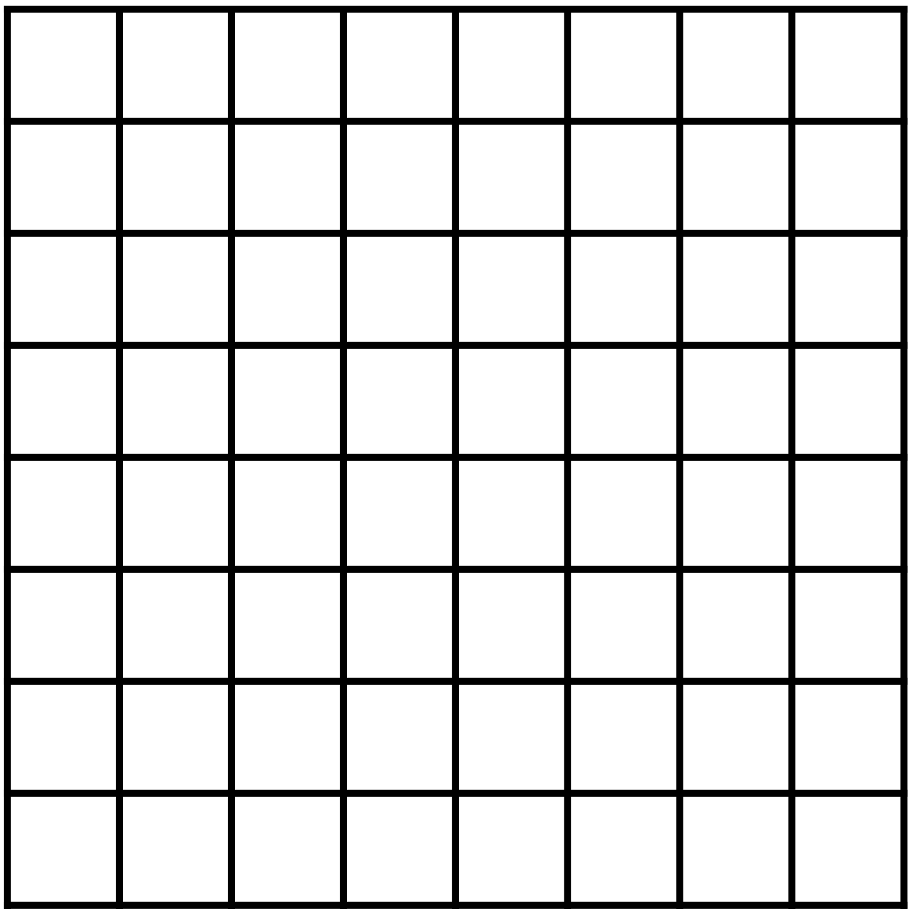	|	8  	|
|	|	16	|

---
## _PPI_ en pratique: la lettre A

| Image							| ppp	|
|-------------------------------|-------|
|		| 	3 	|
|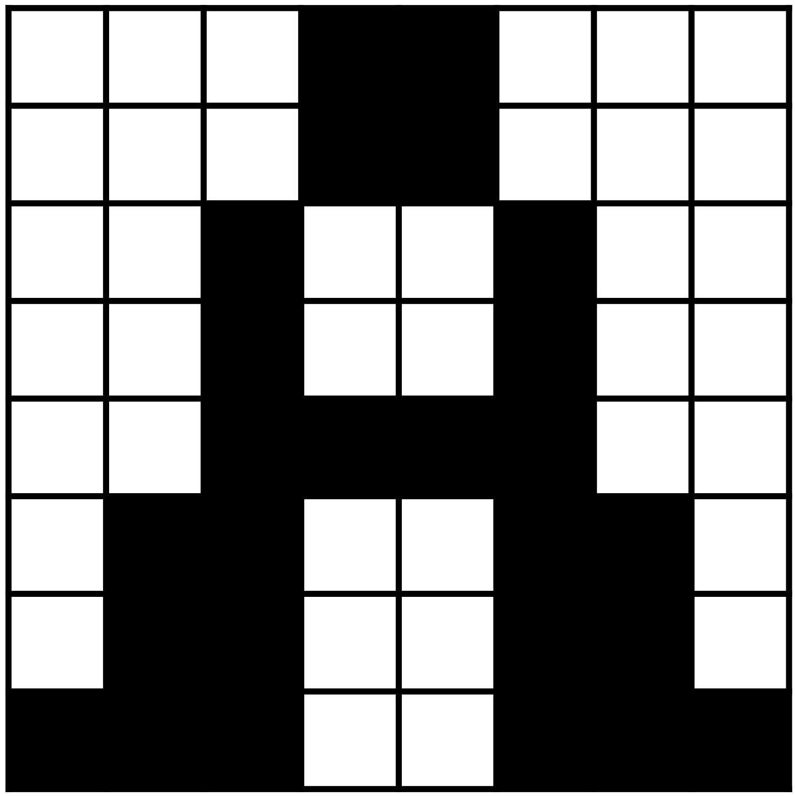		|	8 	|
|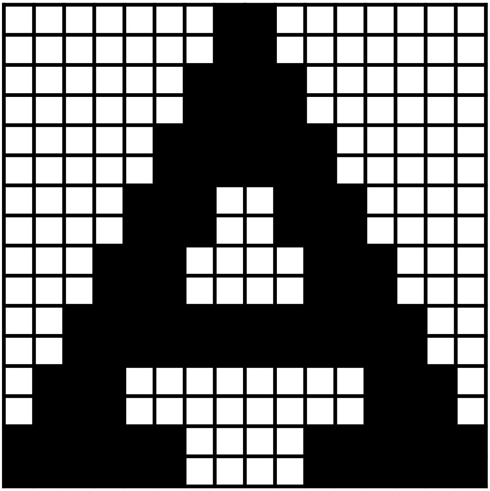	|	16	|

---
## Poids de l'image

Résolution d’une page A4: (dpi*(21/2.54)) * (dpi*(29.7/2.54))


|dpi   | pixels      | total     |
|------|-------------|-----------|
|100   |  826 x 1169 |   965 594 |
|200   | 1650 x 2340 | 3 861 000 |
|300   | 3500 x 2480 | 8 680 000 |

<p style="color:red">Il est louable de vouloir avoir de bonnes images pour l'OCR, mais attention au poids de l'image finale!</p>

---

## Le _B-test_

L'enjeu est de réussir ce que nous appellerons le _B-test_

  


---
## Résolution vs efficacité

Il n’est pas nécessaire d’avoir un grand nombre de pixels (au contraire) pour bien faire fonctionner un OCR.

La schématisation de l'image obtenue par sa pixelisation est une force: trop d'information tue l'information.

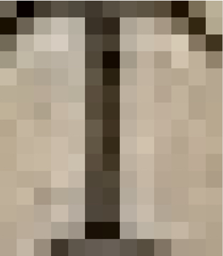 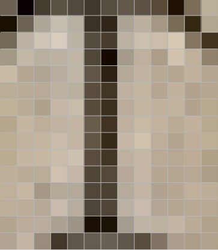  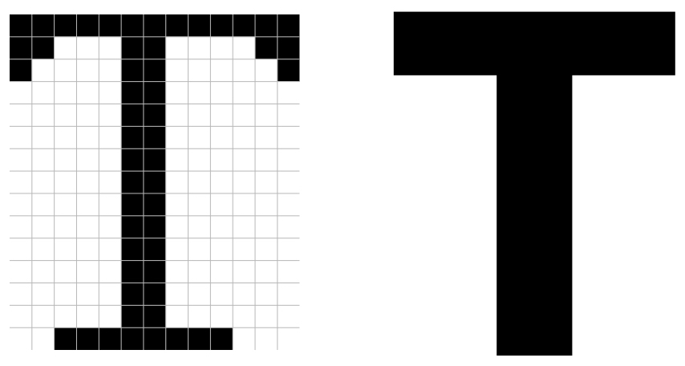

---

## La bonne résolution (III)

300 dpi serait le meilleur rapport poids/qualité


---
# _Pre-processing_
---

## Rotation

| Original 									| Résultat							   |
|-------------------------------------------|--------------------------------------|
|  | |

---
## Niveau de gris

| Original 								| Résultat							   		|
|---------------------------------------|-------------------------------------------|
|  | |

---
## Binarisation

| Original 									 | Résultat							   		|
|--------------------------------------------|------------------------------------------|
|  | |

---
## Segmentation I

| Original 									| Résultat							   		   |
|-------------------------------------------|----------------------------------------------|
|  | |


---
# Segmeteur

---
## Segmentation: mise en page


---
## Segmentation: lignes


L'OCR fonctionnant au niveau des lignes, il est fondamental de les extraire au mieux. L'utilisation d'outil dédié à la segmentation, et non d'un segmenteur intégré à l'OCR, peut être intéressant

---
## Segmentation: ornements


Le segmenteur peut extraire plus que des lignes: il peut extraire, par exemple, des ornements (bandeaux, initiales, culs-de-lampe…)

---
## Données

Il faut réussir décrire les documents OCRisés, afin de reconstruire l'apparence originelle sur la base des informations conservées. On privilégie pour cela des documents XML, _page driven_.

```{xml}
<document>
  <page>
    <zone>
      <ligne coordonnées="points">
        <mot coordonnées="points">exemple</mot>
      <ligne>
    </zone>
  </page>
</document>
```
---
## Données

Afin de faire le lien entre l'image et le texte, on doit donner une information géométrique. Celle-ci peut être de trois ordres: ligne, bloc, ou polygone.

Il existe des documents de niveau page, paragraphe, ligne ou mot.

Il existe aussi plusieurs formats: hOCR, Alto, PageXML… Ces formats sont normalement utilisés avec METS (_Metadata Encoding and Transmission Standard_) pour la description de l'objet numérisé.


---
## Exemple 1: Alto

ALTO: _Analyzed Layout and Text Object_

Développé lors du projet européen METAe (_Meta  Data  engine_, 2000-2003) et publié en 2004

Trois éléments centraux:
* ```<Description>``` contient les métadonnées
* ```<Styles>``` contient le texte 
	* ```<TextStyle>``` contient les informations sur les fontes (famille, type, taille…)
	* ```<ParagraphStyle>``` contient la description des paragraphes (alignement gauche/droite, intelrigne)
* ```<Layout>``` contient le contenu, divisé en ```<Page> ```

---
```{xml}
<?xml version="1.0"?>
<alto>
    <Description>
        <MeasurementUnit/>
        <sourceImageInformation/>
        <Processing/>
    </Description>
    <Styles>
        <TextStyle FONTSIZE="10.0"/>
        <ParagraphStyle ALIGN="Left"/>
    </Styles>
    <Layout>
        <Page ID="P1" WIDTH="123" HPOS="123" VPOS="123">
          <PrintSpace WIDTH="123" HPOS="123" VPOS="123">
            <TextBlock ID="P1_TB1"  WIDTH="123"…>
              <TextLine WIDTH="123" HPOS="123"…>
                <String WIDTH="123"… CONTENT="Un">
                <sp WIDTH="123" HPOS="123" VPOS="123">
                <String WIDTH="123"… CONTENT="Exemple">
              </TextLine>
            </TextBlock
          </PrintSpace>
        </Page>
    </Layout>
</alto>
```

---
## Exemple 2: PageXML

PAGE: _Page Analysis and Ground-truth Elements_

Format créé lors du projet IMPACT EU (2010)

Contraiement à l'ALTO, PageXML conserve des informations sur le _pre-processing_ (binarisation,  deskew,  dewarping…) et l'évaluation du layout.

---

```{xml}
<PcGts>
  <Metadata>...</Metadata>
  <page>
    <TextRegion type="paragraph" id="r_1">
      <Coords points="1474,486 3684,486 3684,900…">
      <TextLine id="l_1">
        <Coords points="1475,487 3683,487 3683,635…">
        <Baseline points="1475,635 1587,635 2061…">
        <Word id="w1">
          <Coords points="1475,497 1587,497 1587…"/>
          <TextEquiv>
            <Unicode>Un</Unicode>
          </TextEquiv>
        </Word>
        <Word id="w2">
          <Coords points="1935,497 2061,497 2061,619…"/>
          <TextEquiv>
            <Unicode>exemple</Unicode>
          </TextEquiv>
        </Word>
        <TextEquiv>
          <Unicode>Un exemple</Unicode>
        </TextEquiv>
  </page>
</PcGts>
```
---
## Exemple 3: hOCR

Format XML _embedded_ dans du XHTML/HTML
Trois grandes classes associées aux éléments html ```<div>```, ```<p>```, ```<span>```
* ```ocr_page```  pour les pages
* ```ocr_par``` pour les paragraphes
* ```ocrx_line``` pour les lignes
* ```ocrx_word``` pour les mots

L'information géométrique est stockée dans une bbox

---
```{xml}
<?xml version="1.0" encoding="UTF-8"?>
  <html xmlns="http://www.w3.org/1999/xhtml">
    <head>
      <title></title>
      <meta name='ocr-system' content='tesseract'/>
    </head>
    <body>
      <div class='ocr_page' id='page_1'
           title='bbox 0 0 1926 3102'>
        <div class='ocr_carea' id='block_1_1'
             title="bbox 638 108 756 147">
          <p class='ocr_par' id='par_1_1' lang='eng'
             title="bbox 638 108 756 147">
            <span class='ocr_line' id='line_1_1'
                  title="bbox 638 108 756 147;
                         baseline 0 0">
              <span class='ocrx_word' id='word_1_1'
                    title='bbox 638 108 756 147'>
                exemple
              </span>
            </span>
          </p>
        </div>
      </div
    </body>
```

---

## DHsegment


Sofia Ares Oliveira, Benoit Seguin, Frederic Kaplan, "dhSegment: A generic deep-learning approach for document segmentation", v.2, [arXiv:1804.10371](https://arxiv.org/abs/1804.10371)

---

## Larex

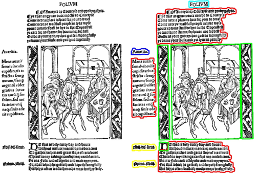

Reul, C., Springmann, U., and Puppe, F., "LAREX - A semi-automatic open-source Tool for Layout Analysis and Region Extraction on Early Printed Books",  [arXiv:1701.07396](https://arxiv.org/abs/1701.07396)

---
## Kraken

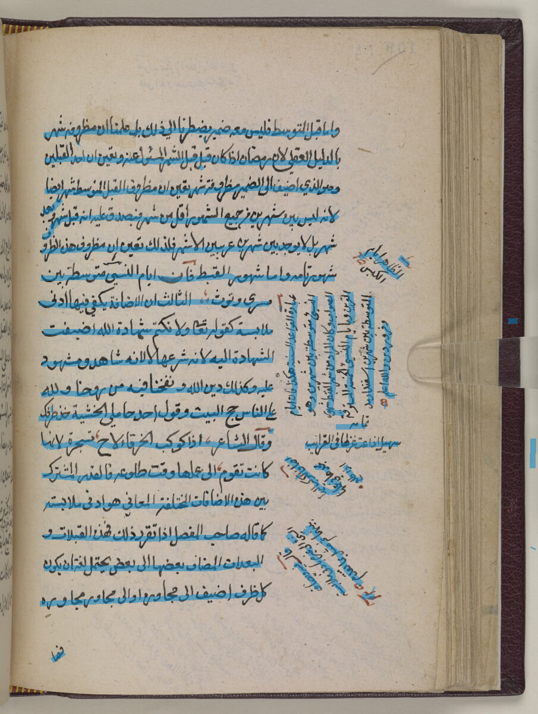

Kiessling, B., Stökl Ben Ezra, D., Miller M., "BADAM: A Public Dataset for Baseline Detection in Arabic-script Manuscripts", HIP@ICDAR 2019. [arXiv:1907.04041](https://arxiv.org/abs/1907.04041)


---
# OCR
---

## OCR
* _Optical character recognition_
* En français ROC (Reconnaissance optique de caractères).
* Extraire le texte d’une image.

---
## Transcrire (I)
Ligne de commandes + interface dans un navigateur

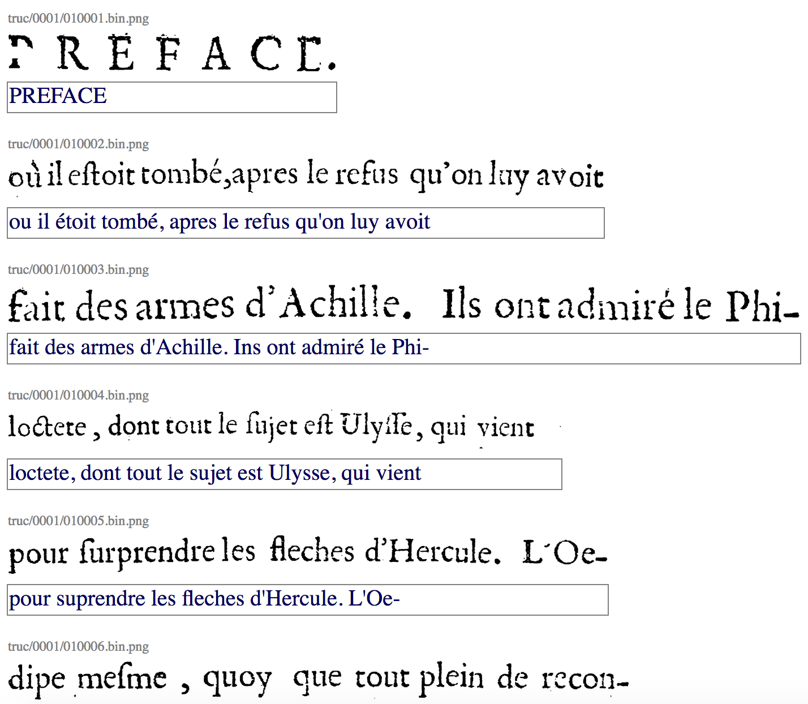

---
## Transcrire (II)
_Transkribus_ (Innsbruck)

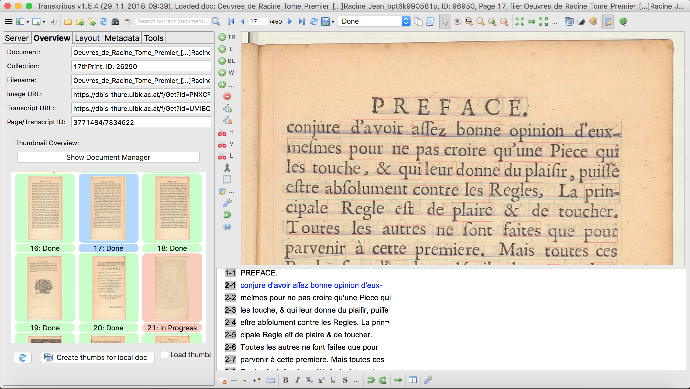


---
## Transcrire (III)
_eScriptorium_ (EPHE/PSL)


--- 

## Création d'une vérité de terrain (_ground truth_)

Les images transcrites sont alors associées à leur transcription


---
## Entraînement (I)

Comme c'est du _machine learning_, on va répéter l'entraînement une multitude de fois (on parle d'_epochs_, de _stages_ …). À chaque fois un modèle est créé: celui qui permforme le mieux est conservé

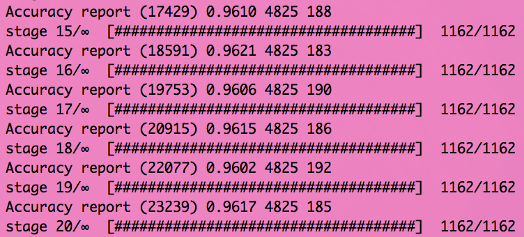

---
## Entraînement (II)

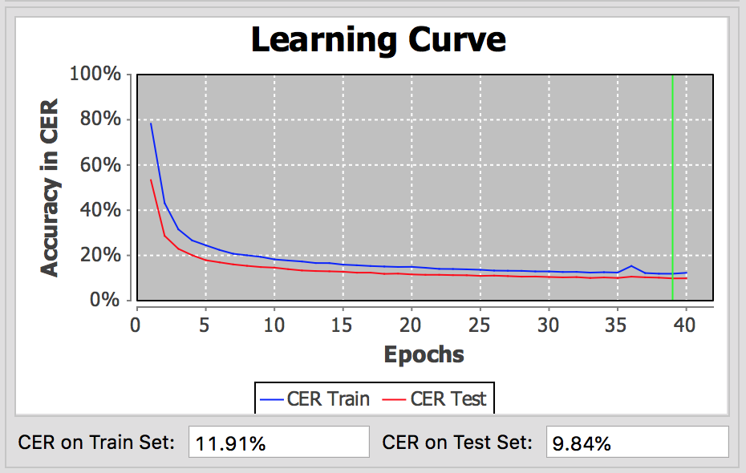

---
## Scores

* On parle de CER (_Character Error Recognition_) et parfois de WER (_Word Error Recognition_).
* Distance de Levenshtein : combien d’opérations pour retrouver le résultat attendu (par exemple entre tonte et toute )?
* <p style="color:red">Une seule lettre fausse crée un mot faux ! Le WER est donc toujours supérieur au CER !</p>
* Ces scores peuvent être calculés sur deux jeux de données :
	* Le train set (on OCRise les images qui servent pour l’entraînement)
	* Le test set (on OCRise des images qui n’ont pas servi pour l’entraînement)
---
## L'amélioration des scores: données artificielles

* Avec Baskerville


* Avec IM FELL English SC


* Avec JSL Ancient


* Avec Chapbook


---
## L'amélioration des scores: bruit

* Original


* Bruit faible


* Bruit fort


---
## L'amélioration des scores: modification du cadre

* Cadre normal


* Cadre élargi


---
# Dans la jungle des outils
---

## Outils
* Tesseract
* Ocropy
* Kraken
* Calamari
* DHsegment
* …

Il est souhaitable de préférer une solution qui intègre les différentes étapes nécessaires à l'OCrisation

---

## _Pipeline_

Il existe plusieurs solutions qui articulent tous les éléments nécessaires pour l'OCRisation
* Web: [eScriptorium](https://scripta.psl.eu/en/)
* Docker: [ocr4all](https://github.com/OCR4all)
* Java: [Transkribus](https://transkribus.eu/Transkribus/)

---

## _Pipeline_ : Comment choisir?

Il existe plusieurs solutions qui articulent tous les éléments nécessaires pour l'OCRisation
* Web: [eScriptorium](https://scripta.psl.eu/en/), <span style="color:green">_open source_</span>
* Docker: [ocr4all](https://github.com/OCR4all), <span style="color:green">_open source_</span>
* Java: [Transkribus](https://transkribus.eu/Transkribus/), <span style="color:red">non _open source_</span>

---

# Bibliographie
* Sami Nousiainen, _Report on File Formats for Hand-written Text Recognition (HTR) Material_, 2016, [en ligne](https://documents.icar-us.eu/documents/2016/12/report-on-file-formats-for-hand-written-text-recognition-htr-material.pdf)
* Kiessling, B., Stökl Ben Ezra, D., Miller M., "BADAM: A Public Dataset for Baseline Detection in Arabic-script Manuscripts", HIP@ICDAR 2019. [arXiv:1907.04041](https://arxiv.org/abs/1907.04041)
* Sofia Ares Oliveira, Benoit Seguin, Frederic Kaplan, "dhSegment: A generic deep-learning approach for document segmentation", v.2, [arXiv:1804.10371](https://arxiv.org/abs/1804.10371)
* Reul, C., Springmann, U., and Puppe, F., "LAREX - A semi-automatic open-source Tool for Layout Analysis and Region Extraction on Early Printed Books",  [arXiv:1701.07396](https://arxiv.org/abs/1701.07396)

---
