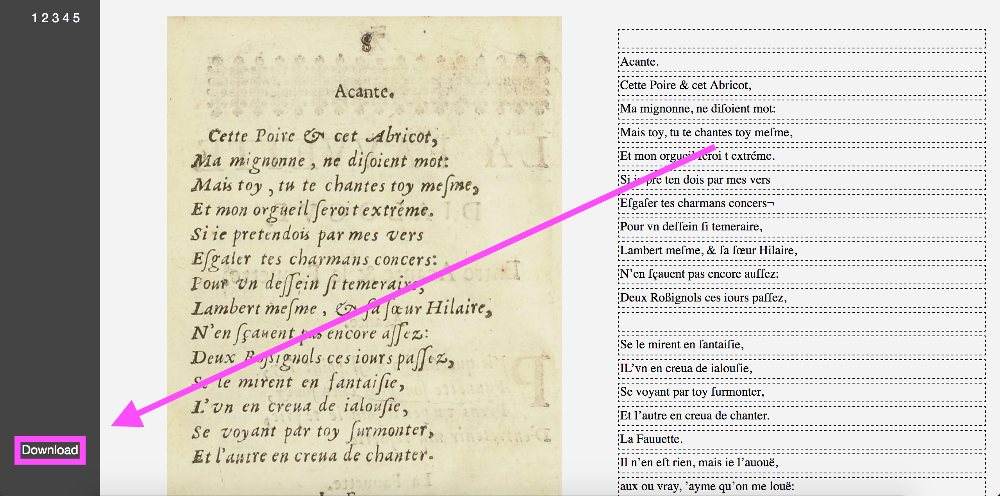

Formation OCR/_GROBID-dictionaries_ 2020

# OCR

Simon Gabay
Strasbourg, Mardi 28 janvier 2020


---
# Kraken
---
## Installation

Il faut avoir python (si possible 3.6) et pip/pip3

Créer un environnement virtuel (optionnel)
* Ubuntu
````
$ virtualenv envK -p /usr/bin/python3.6
# activer l'environnement
source envK/bin/activate
````
* Mac: virtualenv ou conda
```
$ wget https://raw.githubusercontent.com/mittagessen/kraken/master/environment.yml
$ conda env create -f environment.yml
conda activate kraken
```
Une fois dans l'environnement virtuel
```
pip3 install kraken
```

---
## Récupérer des données de base

Obtenir la liste des modèles par défaut
```
$ kraken get default
```

Obtenir la liste des modèles disponibles en téléchargement
```
$ kraken list
```

Obtenir un modèle publié sur Zenodo
```
kraken get 10.5281/zenodo.2577813
```
---

## _Pre-processing_

Binariser les images dans le fichier ```src``` (les images produites seront toutes en .png)
```[shell]
$ kraken -I "img/*" -o .png binarize
# on range les images
$ mkdir img/bin; mv img/*png img/bin/
```

Segmenter les images dans le fichier ```img/bin``` (les images produites seront toutes en .json)
```[shell]
$ kraken -I "img/bin/*.png" -o .json segment
# On range les fichiers
$ mkdir img/seg; mv img/bin/*json img/seg/
```

Binariser puis segmenter les images dans le fichier ```img```
```[shell]
$ kraken -I "img/*jpg" -o .json binarize segment
# on nettoie (on a déjà ces fichiers) répondre "y" si besoin
$ rm -f img/*json
```
---

## _Pre-processing_: alternative

Pour les utilisateurs de linux, on peut préparer les données avec ScanTailor (https://scantailor.org).

Téléchargez-le directement en ligne de commande avec


```[shell]
sudo apt-get install scantailor
```
---

## Transcrire

Produire un fichier html pour transcrire les images contenues dans ```img```
```[shell]
$ ketos transcribe -o gt.html img/*jpg
```

Si on a déjà un modèle (plus ou moins) adapté, il est possible de "pré-remplir" la zone de transcription

```[shell]
$ ketos transcribe --prefill OCR17.mlmodel -o gt.html img/*jpg
```

<p style="color:red">Penser à sauvegarder le résultat en cliquant sur Download</p>

---



---
## Données d'entraînement

Créer les données d'entraînement et les mettre dans un fichier ```gt```

```
$ ketos extract --output gt/ --normalization NFD gt.html
```

L'option ```--normalization NFD``` renvoie à un normalisation unicode: les caractères sont décomposés par équivalence canonique et réordonnés: ```ñ``` (U+00F1) est ainsi la somme de ```n``` (U+006E) et ```~``` (U+0303). Il existe d'autres types de normalisation: NFC, NKFD… (cf [wikipedia](https://fr.wikipedia.org/wiki/Normalisation_Unicode))

---

##  Données pour l'entraînement:

Nous avons besoin de trois jeux de données différents:
1. Des données pour entraîner notre modèle: ```train```
2. Des données pour contrôler l'efficacité des modèles successivement créés lors de l'entraînement: ```val```
3. Des données pour tester le meilleur modèle produit lors de l'entraînement sur des données qui n'ont pas été vues lors de l'entraînement: ```test```

---

##  Données pour l'entraînement:
```test``` peut contenir des données
1. _In-domain_ si elles proviennent des mêmes données que celles présentes dans le ```train``` et le ```val``` (par exemple d'autres lignes d'un **même** imprimé)
2. _Out-of-domain_ si elles proviennent d'une source différente de celles présentes dans le ```train``` et le ```val``` (par exemple d'autres lignes d'un **autre** imprimé)

Evidemment ces données _out-of-domain_ peuvent être plus ou moins éloignées de celles présentes dans dans ```train``` et ```val```: pour en entraînement sur des imprimés du XVIIe s. on peut utiliser des imprimés du XIXème s. français, du XXème s. allemand, voire japonais (même si l'intérêt va être limité)

---

##  Préparer l'entraînement (II)

Jean-Baptiste Camps (PSL-ENC) a écrit un script qui permet de créer ces jeux de données, que vous trouverez dans le dossier:
```
$ python3 randomise_data.py gt/*.png
```

Trois fichiers apparaissent:
1. ```train````
2. ```val````
3. ```test````

---

## Ajouter des données artificielles

```[xml]
$ ketos linegen -f Baskerville transcription.txt
```

Les données produites se retrouvent dans le dossier ```training_data```, qui est créé pour l'occasion

```Baskerville``` doit être remplacé par une fonte qui existe sur votre ordinateur

---

## Créer le  modèle

On lance l'entraînement

```[shell]
$ ketos train -t train.txt -e val.txt
$ cp model_best.mlmodel monModele.model
$ rm -f model_{1..90}.mlmodel #on garde uniqument le fichier model_best.mlmodel
```

Il est possible de faire une normalisation des caractère si cela n'a pas fait avant avec l'option ```-u NFD```

Il est aussi possible de faire du fine-tuning d'un modèle existant

```[xml]
$ cp OCR17.mlmodel OCR17.mlmodel.bk # On fait une sauvegarde
$ ketos train -i OCR17.mlmodel --resize add gt/*.png
$ rm -f model_{1..50}.mlmodel # on garde uniqument le fichier model_best.mlmodel
```

Sauf spécification contraire, Kraken utilise l'_early stopping_ pour sélectionner le meilleur modèle (et éviter l'_overfitting_, cf.[wikipedia](https://fr.wikipedia.org/wiki/Surapprentissage))-

---
## On évalue le modèle

```[xml]
$ ketos test -m monModele.model -e test.txt >eval_model.txt
```

Il est prêt! On peut désormais OCRiser un texte

```
$ kraken -i img/Collectif1660_recueil_bpt6k853407j_10.jpg ocr_result.txt binarize segment ocr -m OCR17.mlmodel
```

Il existe plusieurs options d'export:
1. ```ocr -h``` pour un fichier hOCR
```
$ kraken -i img/Collectif1660_recueil_bpt6k853407j_10.jpg ocr_result.html binarize segment ocr -h -m OCR17.mlmodel
```
2. ```ocr -a``` pour un fichier ALTO
```
$ kraken -i img/Collectif1660_recueil_bpt6k853407j_10.jpg ocr_result.xml binarize segment ocr -a -m OCR17.mlmodel
```
4. ```ocr -y``` pour un fichier abbyyXML

---
# Calamari
---
## Installation

On crée un nouvel environnement virtuel (pas obligatoire)
````
$ virtualenv envC -p /usr/bin/python3.6
# activer l'environnement
source envC/bin/activate
````
On installe Calamari
```
$ pip3 install calamari_ocr
$ pip3 install tensorflow
```
---
## Entraîner un modèle

Nous allons reprendre les fichiers créés avec Kraken.

Pour lancer un entraînement simple (à utiliser avec un _validation set_)

```[shell]
calamari-train --files gt/*png
```

Pour lancer un entraînement "complexe" (à utiliser sans _validation set_) de 5 échantillons (_fold_) par défaut utilisés pour un vote final (_voted prediction_)
```[shell]
calamari-cross-fold-train --files gt/*png --best_models_dir best_models
```

---
## Evaluer le modèle

Prédire
```[shell]
calamari-predict --checkpoint *.ckpt.json --files gt/*png
```

Evaluer le modèle
```[shell]
 calamari-predict --checkpoint *.ckpt.json --files gt/*png
 ```

